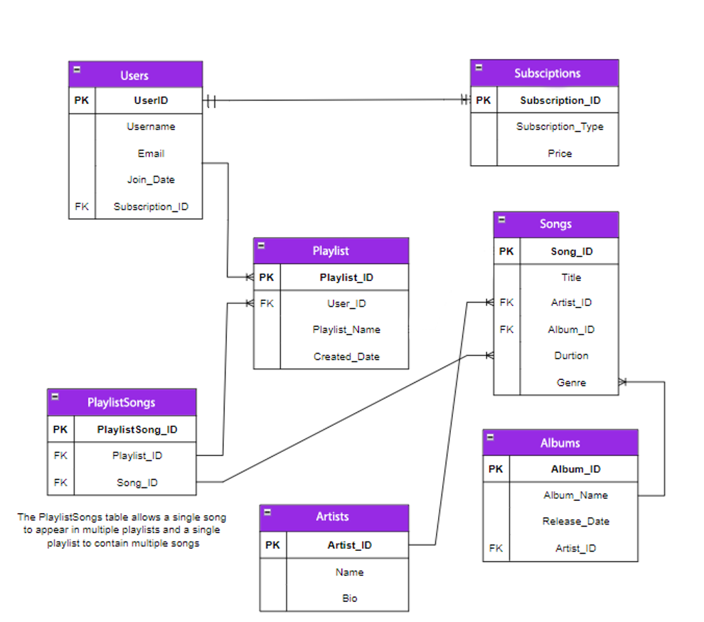

# Tunify ERD

### Tunify Platform is a comprehensive music streaming service designed to provide users with access to a vast library of songs, albums, artists, and playlists. The platform allows users to explore, create, and manage playlists, listen to their favorite songs, and discover new music. It also offers different subscription plans to cater to varying user needs.

## Overview of Relationships and Entities

### Entities
## 1. **Album**
 ##  - Represents a collection of songs released together.
 ##  - Attributes: `AlbumID`, `AlbumName`, `ReleaseDate`, `ArtistID`.

## 2. **Artist**
 ##  - Represents a musical artist or band.
  ## - Attributes: `ArtistID`, `Name`, `Bio`.

## 3. **Playlist**
  ## - Represents a collection of songs created by a user.
  ## - Attributes: `PlaylistID`, `UserID`, `PlaylistName`, `CreatedDate`.

## 4. **PlaylistSongs**
  ## - Represents the relationship between playlists and songs.
  ## - Attributes: `PlaylistSongID`, `PlaylistID`, `SongID`.

## 5. **Song**
 ##  - Represents an individual musical track.
 ##  - Attributes: `SongID`, `Title`, `ArtistID`, `AlbumID`, `Duration`, `Genre`.

## 6. **Subscription**
 ##  - Represents a subscription plan for the users.
 ##  - Attributes: `SubscriptionID`, `SubscriptionType`, `Price`.

## 7. **Users**
 ##  - Represents a user of the platform.
  ## - Attributes: `UserID`, `Username`, `Email`, `JoinDate`, `SubscriptionID`.

### Relationships
## 1. **Artist and Albums**
  ### - One-to-Many relationship:
    ####  - One `Artist` can have many `Albums`.
     #### - An `Album` belongs to one `Artist`.

## 2. **Artist and Songs**
  ### - One-to-Many relationship:
   ####  - One `Artist` can have many `Songs`.
    #### - A `Song` belongs to one `Artist`.

## 3. **Album and Songs**
  ### - One-to-Many relationship:
   ####  - One `Album` can contain many `Songs`.
    ####  - A `Song` belongs to one `Album`.

## 4. **Users and Playlists**
  ### - One-to-Many relationship:
   ####  - One `User` can create many `Playlists`.
    #### - A `Playlist` belongs to one `User`.

## 5. **Playlists and Songs**
  ### - Many-to-Many relationship via `PlaylistSongs`:
   ####  - A `Playlist` can contain many `Songs`.
   ####  - A `Song` can be part of many `Playlists`.

## 6. **Subscription and Users**
  ### - One-to-Many relationship:
   ####  - One `Subscription` can be assigned to many `Users`.
   ####  - A `User` subscribes to one `Subscription`.

