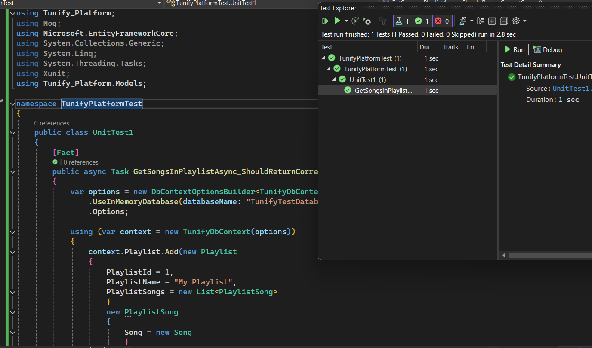
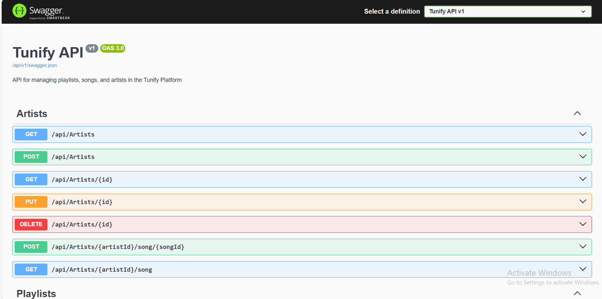

# Tunify ERD

### Tunify Platform is a comprehensive music streaming service designed to provide users with access to a vast library of songs, albums, artists, and playlists. The platform allows users to explore, create, and manage playlists, listen to their favorite songs, and discover new music. It also offers different subscription plans to cater to varying user needs.

## Overview of Relationships and Entities

### Entities
## 1. **Album**
 ##  - Represents a collection of songs released together.
 ##  - Attributes: `AlbumID`, `AlbumName`, `ReleaseDate`, `ArtistID`.

## 2. **Artist**
 ##  - Represents a musical artist or band.
  ## - Attributes: `ArtistID`, `Name`, `Bio`.

## 3. **Playlist**
  ## - Represents a collection of songs created by a user.
  ## - Attributes: `PlaylistID`, `UserID`, `PlaylistName`, `CreatedDate`.

## 4. **PlaylistSongs**
  ## - Represents the relationship between playlists and songs.
  ## - Attributes: `PlaylistSongID`, `PlaylistID`, `SongID`.

## 5. **Song**
 ##  - Represents an individual musical track.
 ##  - Attributes: `SongID`, `Title`, `ArtistID`, `AlbumID`, `Duration`, `Genre`.

## 6. **Subscription**
 ##  - Represents a subscription plan for the users.
 ##  - Attributes: `SubscriptionID`, `SubscriptionType`, `Price`.

## 7. **Users**
 ##  - Represents a user of the platform.
  ## - Attributes: `UserID`, `Username`, `Email`, `JoinDate`, `SubscriptionID`.

### Relationships
## 1. **Artist and Albums**
  ### - One-to-Many relationship:
    ####  - One `Artist` can have many `Albums`.
     #### - An `Album` belongs to one `Artist`.

## 2. **Artist and Songs**
  ### - One-to-Many relationship:
   ####  - One `Artist` can have many `Songs`.
    #### - A `Song` belongs to one `Artist`.

## 3. **Album and Songs**
  ### - One-to-Many relationship:
   ####  - One `Album` can contain many `Songs`.
    ####  - A `Song` belongs to one `Album`.

## 4. **Users and Playlists**
  ### - One-to-Many relationship:
   ####  - One `User` can create many `Playlists`.
    #### - A `Playlist` belongs to one `User`.

## 5. **Playlists and Songs**
  ### - Many-to-Many relationship via `PlaylistSongs`:
   ####  - A `Playlist` can contain many `Songs`.
   ####  - A `Song` can be part of many `Playlists`.

## 6. **Subscription and Users**
  ### - One-to-Many relationship:
   ####  - One `Subscription` can be assigned to many `Users`.
   ####  - A `User` subscribes to one `Subscription`.
   # <> <> <> <> <> <> <> <> <> <> <> <> <> <> <> 
   # Lab 12: Tunify Platform - Repo Integration:
   ### We prepared the Repositories file, which includes two files, one for writing Interfaces and the other for writing Services,
   ### and created a control file to communicate directly with the Db using the crud,
   ### and the repository works to cancel direct interaction with the DbContext and is dealt with via services.

   ### lab13 "Routing"
   

# 1) I writing the New Code in IArtist "Task<IEnumerable<Song>> GetSongsByArtistAsync(int artistId);" to make Relations with Song "Mony"
# 2) writing in IPlay "Task<IEnumerable<Song>> GetSongsInPlaylistAsync(int playlistId);" to make Relations with Song "Mony"
# 3) writing this code in services "public async Task AddSongToArtistAsync(int artistId, int songId
       # {
         #   var artist = await _context.Artist.Include(a => a.Songs).FirstOrDefaultAsync(a => a.ArtistId == artistId);
           # if (artist == null)
           # {
           #     throw new Exception("Artist not found");
           # }

          #  var song = await _context.Song.FindAsync(songId);
          #  if (song == null)
          #  {
                throw new Exception("Song not found");
         #   }

          #  artist.Songs.Add(song);
          #   await _context.SaveChangesAsync();"
             
       # 4) public async Task<IEnumerable<Song>> GetSongsByArtistAsync(int artistId)
      #  {
           # var artist = await _context.Artist.Include(a => a.Songs).FirstOrDefaultAsync(a => a.ArtistId == artistId);
          #  if (artist == null)
         #   {
                throw new Exception("Artist not found");
          #  }

          #  return artist.Songs;
     #   }
     # 5) i write like this in all pages you want updates

     ## Swaggest UI
     # 1) swaggest configration
     #builder.Services.AddSwaggerGen(options =>
            {
                options.SwaggerDoc("v1", new Microsoft.OpenApi.Models.OpenApiInfo
                {
                    Title = "Tunify API",
                    Version = "v1",
                    Description = "API for managing playlists, songs, and artists in the Tunify Platform"
                });
            });
             # 2) // call swagger service "v1 is the document Name"
            app.UseSwagger(
             options =>
             {
                 options.RouteTemplate = "api/{documentName}/swagger.json";
             }
             );
             # 3) // call swagger UI
            app.UseSwaggerUI(options =>
            {
                options.SwaggerEndpoint("/api/v1/swagger.json", "Tunify API v1");  
                options.RoutePrefix = "Tunifyswagger";
            });
            

